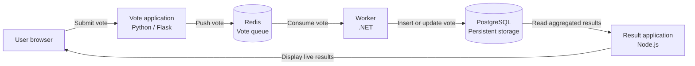
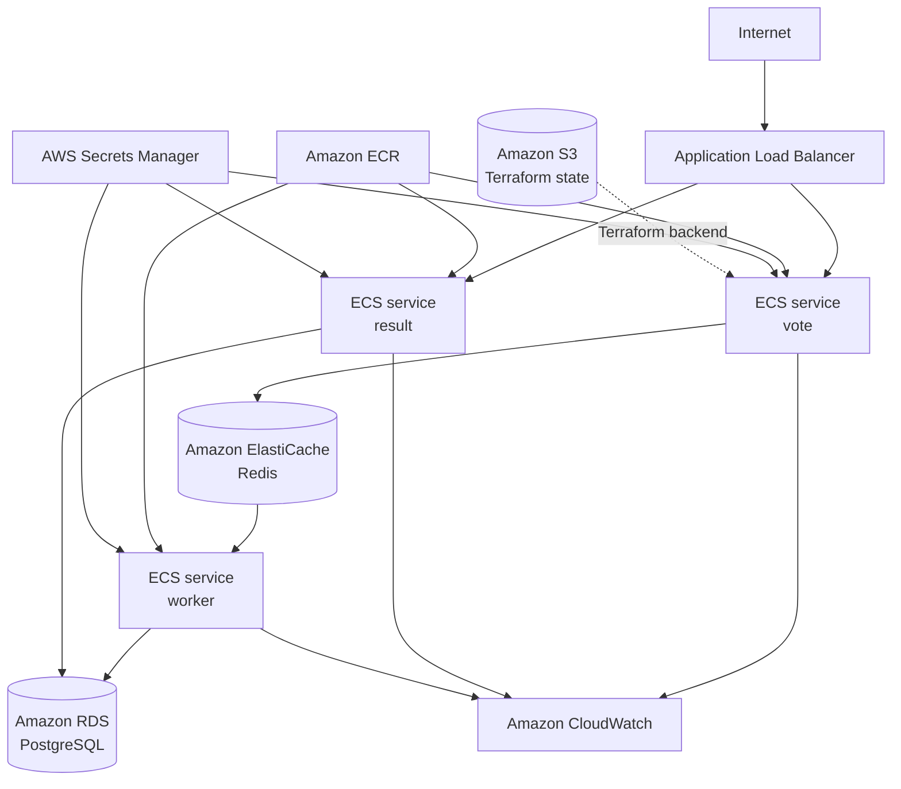

# AWS Voting Platform

A cloud engineering and DevOps portfolio project based on Docker's Example Voting App.

The project demonstrates how a simple distributed application can be prepared for deployment on AWS using Docker, Terraform, Ansible, CI/CD, managed AWS services, observability, security controls, and infrastructure automation.

Repository: [kxmyk/aws-voting-platform](https://github.com/kxmyk/aws-voting-platform)

## Project overview

The application allows users to vote between two options and view the results in real time.

Although the business logic is intentionally simple, the application consists of multiple services written in different technologies:

* Python and Flask for receiving votes;
* Redis as a message queue;
* .NET for background vote processing;
* PostgreSQL for persistent storage;
* Node.js for displaying live results.

This makes the application a useful foundation for practicing containerization, distributed systems, infrastructure as code, cloud networking, CI/CD, monitoring, and operational reliability.

## Architecture



### Application components

| Component | Technology     | Responsibility                                          |
| --------- | -------------- | ------------------------------------------------------- |
| `vote`    | Python / Flask | Receives votes from users and sends them to Redis       |
| `redis`   | Redis          | Temporarily queues submitted votes                      |
| `worker`  | .NET 10        | Consumes votes from Redis and stores them in PostgreSQL |
| `db`      | PostgreSQL     | Stores the current vote for every browser client        |
| `result`  | Node.js        | Reads and displays voting results in real time          |

## Data flow

1. A user opens the `vote` application.
2. The user selects one of the available options.
3. The application creates a vote message containing the browser identifier and selected option.
4. The vote message is pushed to a Redis list.
5. The .NET worker waits for messages in Redis.
6. The worker consumes the vote and writes it to PostgreSQL.
7. The `result` application reads aggregated values from PostgreSQL.
8. Updated results are displayed in the user's browser.

The application uses a producer-consumer architecture:

```text
vote → Redis → worker → PostgreSQL → result
```

Where:

* `vote` is the producer;
* Redis is the queue;
* `worker` is the consumer;
* PostgreSQL is the persistent data store;
* `result` is the read and presentation layer.

## Local development

### Requirements

Install:

* Docker Engine;
* Docker Compose v2;
* Git.

Verify the installation:

```bash
docker version
docker compose version
```

### Configuration

Copy the example environment file:

```bash
cp .env.example .env
```

Set a local PostgreSQL password in `.env`:

```dotenv
DB_PASSWORD=replace-with-a-local-development-password
```

Do not commit the `.env` file.

Application configuration is provided through environment variables instead of being hardcoded in source code.

### Start the application

Validate the Compose configuration:

```bash
docker compose config
```

Build the images:

```bash
docker compose build
```

Start the complete application stack:

```bash
docker compose up --detach --wait
```

The applications will be available at:

| Application | URL                   |
| ----------- | --------------------- |
| Vote        | http://localhost:8080 |
| Results     | http://localhost:8081 |

View running services:

```bash
docker compose ps
```

View logs:

```bash
docker compose logs --follow
```

Stop the application:

```bash
docker compose down
```

Stop the application and remove local volumes:

```bash
docker compose down --volumes
```

Removing volumes deletes locally stored PostgreSQL and Redis data.

## Health and readiness checks

The web applications expose separate liveness and readiness endpoints.

### Vote application

```text
GET http://localhost:8080/health
GET http://localhost:8080/ready
```

The readiness endpoint verifies that the application can communicate with Redis.

### Result application

```text
GET http://localhost:8081/health
GET http://localhost:8081/ready
```

The readiness endpoint verifies that the application can communicate with PostgreSQL.

### Worker

The worker does not expose an HTTP server.

Instead, it periodically updates a heartbeat file inside the container. The Docker health check verifies that the heartbeat timestamp is recent.

This allows Docker to detect a worker process that is running but no longer actively processing its execution loop.

## Integration test

The repository contains an automated Docker Compose integration test:

```bash
./scripts/compose-integration-test.sh
```

The test:

* validates the Docker Compose configuration;
* builds all application images;
* starts the complete stack;
* waits for container health checks;
* checks application health and readiness endpoints;
* submits a test vote;
* verifies that the vote reaches PostgreSQL;
* verifies the worker heartbeat;
* prints diagnostic logs on failure;
* removes containers and test volumes after completion.

The same test is executed in GitHub Actions.

## Project structure

```text
.
├── .github/
│   └── workflows/
├── infra/
│   └── bootstrap/
├── result/
├── scripts/
├── vote/
├── worker/
├── docker-compose.yml
├── .env.example
├── LICENSE
└── README.md
```

### Important directories

| Path                 | Description                                            |
| -------------------- | ------------------------------------------------------ |
| `vote/`              | Python voting application and its Docker image         |
| `result/`            | Node.js results application and its Docker image       |
| `worker/`            | .NET background worker and its Docker image            |
| `scripts/`           | Local and CI integration test scripts                  |
| `infra/bootstrap/`   | Terraform configuration for the remote state S3 bucket |
| `.github/workflows/` | Continuous integration workflows                       |

## Infrastructure as Code

Terraform is used to manage AWS infrastructure.

The first infrastructure component is a dedicated S3 bucket for Terraform state.

The state bucket is configured with:

* S3 versioning;
* server-side encryption;
* full S3 Block Public Access;
* bucket owner enforced object ownership;
* a bucket policy denying insecure transport;
* Terraform protection against accidental destruction;
* common project tags.

The bootstrap configuration is located in:

```text
infra/bootstrap
```

The bootstrap state is initially stored locally because the remote backend bucket must exist before Terraform can use it.

The main development environment will later store its state under:

```text
environments/dev/terraform.tfstate
```

## Project progress

### Phase 1 — Local baseline ✅

The original application was forked, built, tested, and documented locally.

Completed work includes:

* configuring the project repository and upstream remote;
* building and running the full Docker Compose stack;
* verifying Redis and PostgreSQL data flow;
* testing application logs and service communication;
* adding a local end-to-end smoke test.

### Phase 2 — Cloud-ready application ✅

The application was prepared for future cloud deployment.

Completed work includes:

* externalizing Redis and PostgreSQL configuration;
* removing hardcoded database credentials;
* adding `.env.example`;
* adding Docker build context exclusions;
* adding liveness and readiness checks;
* adding a worker heartbeat health check;
* upgrading the worker to .NET 10;
* adding automatic Compose integration testing;
* replacing registry-dependent workflows with reproducible build checks.

### Phase 3 — Terraform bootstrap 🚧

Current infrastructure work includes:

* creating the Terraform project structure;
* configuring the AWS provider;
* defining Terraform and provider version constraints;
* creating a secure S3 bucket for Terraform state;
* enabling versioning and encryption;
* blocking all public access;
* enforcing bucket ownership controls;
* adding shared AWS resource tags;
* documenting the bootstrap process.

Next steps:

* connect the development environment to the remote S3 backend;
* enable native S3 state locking;
* add Terraform validation and security checks to CI.

### Phase 4 — AWS networking 📋

Planned work:

* VPC;
* public application subnets;
* private application subnets;
* private database subnets;
* Internet Gateway;
* route tables;
* security groups;
* VPC Flow Logs;
* a cost-aware development architecture without NAT Gateway;
* documentation of a production Multi-AZ variant.

### Phase 5 — EC2 and Ansible deployment 📋

Planned work:

* provisioning an EC2 instance with Terraform;
* managing access through AWS Systems Manager;
* avoiding public SSH access;
* installing Docker with Ansible;
* deploying the application through Docker Compose;
* configuring CloudWatch Agent;
* adding deployment, rollback, and troubleshooting procedures.

### Phase 6 — ECR and CI/CD 📋

Planned work:

* creating separate ECR repositories for application images;
* enabling image scanning and lifecycle policies;
* tagging images with Git commit identifiers;
* authenticating CI/CD to AWS using OIDC;
* building, testing, scanning, and publishing application images;
* automating Terraform plans and controlled deployments.

### Phase 7 — Managed data services 📋

Planned work:

* migrating PostgreSQL to Amazon RDS;
* migrating Redis to Amazon ElastiCache;
* using private database subnets;
* disabling public database access;
* storing connection credentials securely;
* testing data persistence and service recovery.

### Phase 8 — ECS Fargate migration 📋

Planned work:

* deploying `vote`, `result`, and `worker` as independent ECS services;
* adding an Application Load Balancer;
* configuring ECS health checks and deployment rollback;
* passing secrets securely to ECS tasks;
* enabling ECS Exec and CloudWatch Logs;
* adding service autoscaling.

The EC2 implementation will remain documented as an alternative deployment architecture.

### Phase 9 — Observability and operations 📋

Planned work:

* CloudWatch Logs and metrics;
* application and infrastructure dashboards;
* alarms and SNS notifications;
* structured JSON logging;
* correlation identifiers;
* Container Insights;
* local Grafana and VictoriaMetrics;
* OpenTelemetry-based tracing;
* operational runbooks.

### Phase 10 — Security and reliability 📋

Planned work:

* HTTPS with AWS Certificate Manager;
* least-privilege IAM policies;
* dependency, container, secret, and IaC scanning;
* backup and restore testing;
* failure injection scenarios;
* rollback testing;
* load testing;
* RTO and RPO documentation.

### Phase 11 — Portfolio documentation 📋

Planned work:

* current and target architecture diagrams;
* CI/CD diagrams;
* deployment and teardown instructions;
* AWS cost analysis;
* infrastructure decisions;
* troubleshooting guides;
* operational runbooks;
* load-test results;
* monitoring screenshots;
* lessons learned;
* known limitations.

## Planned AWS architecture

The project will be developed incrementally.

The initial AWS deployment will use EC2 and Docker Compose. It will later be migrated to ECS Fargate.



This diagram represents the target architecture, not the current deployment state.

## Security principles

The project follows these rules:

* no AWS access keys stored in the repository;
* no database passwords hardcoded in application source code;
* no committed `.env` files;
* no public access to Terraform state;
* no public SSH access planned for EC2;
* AWS access from CI/CD through temporary OIDC credentials;
* managed secrets instead of plain-text production variables;
* encrypted data storage;
* least-privilege IAM as the target permission model;
* immutable image tags for deployments.

## Known limitations

This application is based on a demonstration project and is not intended to represent a complete production voting system.

Current limitations include:

* one vote is accepted per browser identifier;
* Redis lists provide only a simplified queue implementation;
* a message may be lost if it is removed from Redis before a failed database write;
* there is no dead-letter queue;
* there is no full message acknowledgement mechanism;
* browser identifiers are not a secure user identity mechanism;
* the project does not currently provide strong delivery guarantees;
* the application does not currently support user authentication.

These limitations are intentional discussion points for future reliability improvements.

## Original project

This repository is based on Docker's Example Voting App:

[github.com/dockersamples/example-voting-app](https://github.com/dockersamples/example-voting-app)

The original application provides the distributed application workload. This repository extends it with cloud-ready configuration, health checks, automated integration testing, infrastructure as code, AWS deployment architecture, CI/CD, security practices, monitoring, and operational documentation.

## License

The original project license has been preserved.

See [LICENSE](LICENSE) for details.
