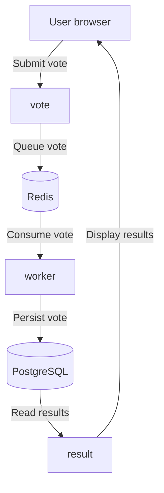
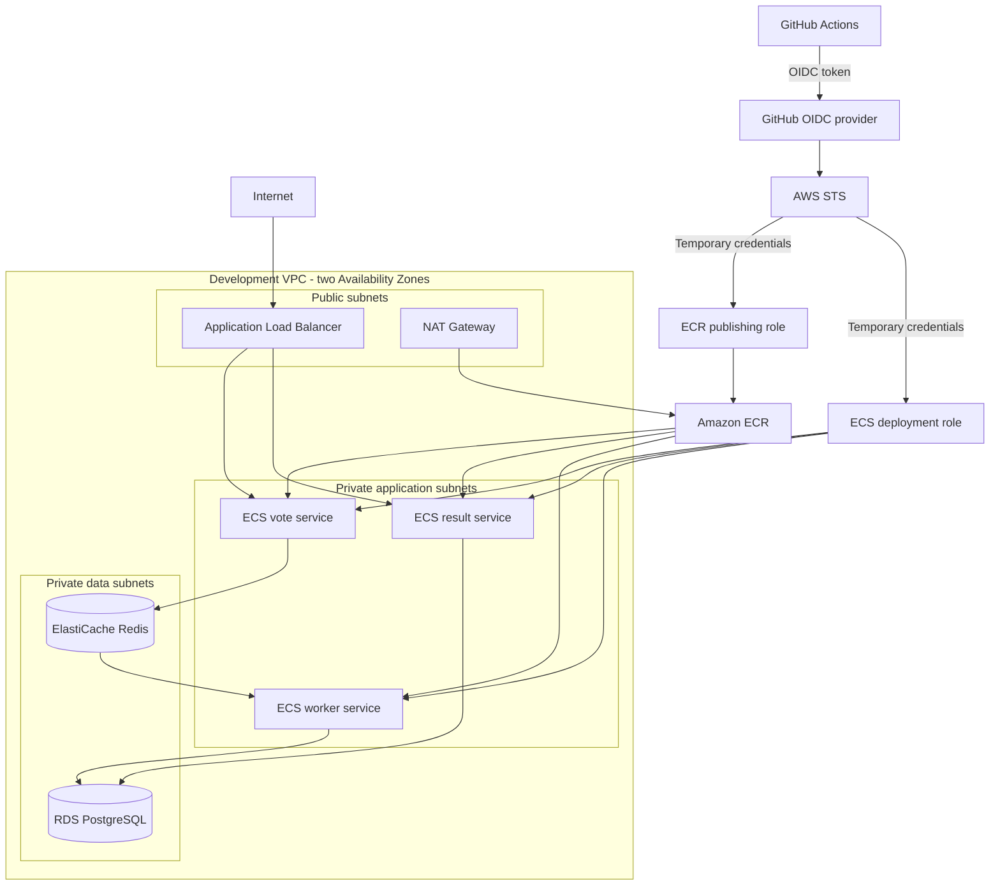

# AWS Voting Platform

[](https://github.com/kxmyk/aws-voting-platform/actions/workflows/compose-integration.yaml)
[](https://github.com/kxmyk/aws-voting-platform/actions/workflows/publish-images-ecr.yaml)
[](https://github.com/kxmyk/aws-voting-platform/actions/workflows/deploy-ecs.yaml)

AWS Voting Platform is a cloud engineering and DevOps portfolio project based on Docker's Example Voting App.

The project demonstrates how a distributed container application can be prepared for AWS, tested automatically, provisioned with Terraform and deployed to Amazon ECS using short-lived GitHub Actions credentials.

Repository: [github.com/kxmyk/aws-voting-platform](https://github.com/kxmyk/aws-voting-platform)

## Project status

| Area | Status |
| --- | --- |
| Local Docker Compose baseline | Complete |
| Cloud-ready application configuration | Complete |
| Application health checks and integration test | Complete |
| Terraform bootstrap and remote state | Complete |
| Multi-AZ VPC and least-privilege security groups | Complete |
| Amazon ECR and image publishing through GitHub OIDC | Complete |
| Amazon ECS cluster and IAM foundation | Complete |
| Amazon RDS PostgreSQL and ElastiCache Redis | Complete |
| ECS Task Definitions and ECS Services | Complete |
| Application Load Balancer | Complete |
| Immutable ECS deployment workflow | Complete; GitHub-hosted E2E verified |
| ECS self-healing and circuit-breaker rollback | Complete |
| Terraform no-drift verification and final teardown | Complete |
| Route 53, ACM and HTTPS | Deliberately out of scope |
| Advanced observability | Deliberately out of scope |

The development environment was recreated and verified end to end in AWS, then destroyed to stop runtime costs. The final test covered GitHub-hosted image publishing and deployment, the complete vote flow, worker self-healing, ECS circuit-breaker rollback, Terraform no-drift and cleanup. Persistent shared resources use separate Terraform states.

## Project goals

The project focuses on practical Cloud and DevOps engineering skills:

- operating and testing a multi-service container application;
- preparing applications for managed cloud environments;
- designing public, application and data network tiers;
- managing reusable AWS infrastructure with Terraform;
- keeping persistent and temporary infrastructure in separate states;
- authenticating GitHub Actions with OpenID Connect instead of access keys;
- applying least-privilege IAM and service-specific security groups;
- publishing immutable, traceable container images;
- deploying workloads to Amazon ECS with AWS Fargate;
- managing secrets without committing credentials;
- validating deployment stability and controlling development costs;
- documenting architecture, operations and known limitations.

Kubernetes is intentionally outside the main project scope. Amazon ECS with AWS Fargate is the target runtime.

## Application overview

The application lets users vote between two options and view the results.

| Component | Technology | Responsibility |
| --- | --- | --- |
| `vote` | Python / Flask / Gunicorn | Receives votes and writes them to Redis |
| `redis` | Redis | Temporarily queues submitted votes |
| `worker` | .NET | Reads votes from Redis and persists them in PostgreSQL |
| `postgres` | PostgreSQL | Stores processed votes |
| `result` | Node.js / Express | Reads and displays voting results |


```mermaid
flowchart TB
    User["User browser"]
    Vote["vote"]
    Redis[("Redis")]
    Worker["worker"]
    Database[("PostgreSQL")]
    Result["result"]

    User -->|"Submit vote"| Vote
    Vote -->|"Queue vote"| Redis
    Redis -->|"Consume vote"| Worker
    Worker -->|"Persist vote"| Database
    Database -->|"Read results"| Result
    Result -->|"Display results"| User
```

The core data flow is:

```text
vote -> Redis -> worker -> PostgreSQL -> result
```

## Local development

### Requirements

- Docker Engine;
- Docker Compose v2;
- Git;
- `curl` for the integration test.

```bash
docker version
docker compose version
git version
curl --version
```

### Configuration

Create the local environment file:

```bash
cp .env.example .env
```

Set a local PostgreSQL password in `.env`:

```dotenv
DB_PASSWORD=replace-with-a-local-development-password
```

Do not commit `.env`.

### Start the stack

```bash
docker compose config
docker compose build
docker compose up --detach --wait
```

| Application | URL |
| --- | --- |
| Vote | http://localhost:8080 |
| Results | http://localhost:8081 |

Useful commands:

```bash
docker compose ps
docker compose logs --follow
docker compose down
docker compose down --volumes
```

Removing volumes deletes local Redis and PostgreSQL data.

## Health and readiness

### Vote

```text
GET http://localhost:8080/health
GET http://localhost:8080/ready
```

The readiness endpoint verifies connectivity to Redis.

### Result

```text
GET http://localhost:8081/health
GET http://localhost:8081/ready
```

The readiness endpoint verifies connectivity to PostgreSQL.

### Worker

The worker periodically updates a heartbeat file. Its container health check verifies that the heartbeat timestamp is recent.

Application containers also:

- log to standard output and standard error;
- handle termination signals;
- run as non-root users;
- use pinned base-image versions;
- receive environment-specific configuration at runtime.

## Automated application testing

Run the complete Docker Compose integration test:

```bash
./scripts/compose-integration-test.sh
```

The script:

1. validates the Compose configuration;
2. builds all application images;
3. starts the complete stack and waits for health checks;
4. checks the `vote` and `result` health and readiness endpoints;
5. submits a test vote;
6. waits for the worker to persist it in PostgreSQL;
7. verifies the stored vote and worker heartbeat;
8. removes containers, networks and test volumes.

The same integration flow runs on pull requests and pushes through GitHub Actions.

## AWS architecture

The deployed development environment uses `eu-central-1` and two Availability Zones.


```mermaid
flowchart TB
    Internet["Internet"]
    GitHub["GitHub Actions"]
    OIDC["GitHub OIDC provider"]
    STS["AWS STS"]
    PublishRole["ECR publishing role"]
    DeployRole["ECS deployment role"]
    ECR["Amazon ECR"]

    subgraph VPC["Development VPC - two Availability Zones"]
        subgraph Public["Public subnets"]
            ALB["Application Load Balancer"]
            NAT["NAT Gateway"]
        end

        subgraph Application["Private application subnets"]
            VoteTask["ECS vote service"]
            ResultTask["ECS result service"]
            WorkerTask["ECS worker service"]
        end

        subgraph Data["Private data subnets"]
            Redis[("ElastiCache Redis")]
            RDS[("RDS PostgreSQL")]
        end
    end

    GitHub -->|"OIDC token"| OIDC
    OIDC --> STS
    STS -->|"Temporary credentials"| PublishRole
    STS -->|"Temporary credentials"| DeployRole
    PublishRole --> ECR
    DeployRole --> VoteTask
    DeployRole --> ResultTask
    DeployRole --> WorkerTask
    Internet --> ALB
    ALB --> VoteTask
    ALB --> ResultTask
    ECR --> VoteTask
    ECR --> ResultTask
    ECR --> WorkerTask
    VoteTask --> Redis
    Redis --> WorkerTask
    WorkerTask --> RDS
    ResultTask --> RDS
    NAT --> ECR
```

### Networking

The VPC uses three network tiers across two Availability Zones:

| Tier | Default CIDRs | Resources |
| --- | --- | --- |
| Public | `10.20.0.0/24`, `10.20.1.0/24` | ALB and NAT Gateway |
| Private application | `10.20.10.0/24`, `10.20.11.0/24` | ECS Fargate tasks |
| Private data | `10.20.20.0/24`, `10.20.21.0/24` | RDS and ElastiCache |

The default development configuration uses one NAT Gateway. The network module also supports `none` and `per_az` modes. Running the application without NAT requires appropriate VPC endpoints or another outbound-access design so that private tasks can reach ECR and required AWS APIs.

ECS tasks do not receive public IP addresses. RDS and Redis are not publicly accessible.

Security groups allow only the required service paths:

- internet -> ALB on port 80;
- ALB -> `vote` and `result` on port 80;
- `vote` and `worker` -> Redis on port 6379;
- `result` and `worker` -> PostgreSQL on port 5432;
- application tasks -> HTTPS endpoints required for AWS service access.

A custom domain, Route 53, ACM and HTTPS were deliberately left out to avoid domain registration and ongoing Hosted Zone costs. The temporary test endpoint therefore uses the generated ALB DNS name over HTTP.

### Data layer

Amazon RDS PostgreSQL:

- runs in private data subnets;
- uses encrypted `gp3` storage;
- is not publicly accessible;
- manages the master password through AWS Secrets Manager;
- uses automated backups for the development environment;
- accepts traffic only from the `result` and `worker` security groups.

Amazon ElastiCache Redis:

- runs in private data subnets;
- is not publicly accessible;
- uses encryption at rest and TLS in transit;
- accepts traffic only from the `vote` and `worker` security groups;
- uses a cost-oriented single-node development configuration.

### Amazon ECS

The ECS layer includes:

- one development ECS cluster;
- `FARGATE` and optional `FARGATE_SPOT` capacity providers;
- separate CloudWatch Log Groups for `vote`, `result` and `worker`;
- one Task Execution Role limited to required ECR, Logs and Secrets Manager access;
- separate Task Roles for each application service;
- revision-specific Fargate Task Definitions;
- three ECS Services with desired count `1` by default;
- deployment circuit breakers with automatic ECS rollback;
- container and target group health checks;
- Application Load Balancer integration for `vote` and `result`.

The Application Load Balancer currently routes:

| Path | Target |
| --- | --- |
| `/` | `vote` |
| `/results` | `result` |
| Result assets and Socket.IO paths | `result` |

## Terraform structure

The infrastructure is split into three Terraform root modules.

| Root | Lifecycle | Responsibility |
| --- | --- | --- |
| `infra/bootstrap` | Persistent | Secure S3 bucket for Terraform state |
| `infra/shared` | Persistent | ECR repositories, GitHub OIDC provider and GitHub Actions IAM roles |
| `infra/environments/dev` | Temporary | VPC, security, ECS, ALB, RDS, Redis and application services |

Reusable modules live under `infra/modules`:

| Module | Responsibility |
| --- | --- |
| `network` | VPC, subnets, routing, Internet Gateway and NAT Gateway |
| `security` | Service-specific security groups and rules |
| `ecr` | Immutable repositories, scanning and lifecycle policies |
| `ecs` | Cluster, log groups and ECS IAM roles |
| `rds-postgres` | Private PostgreSQL instance and subnet group |
| `elasticache-redis` | Private Redis replication group and subnet group |
| `alb` | Load balancer, target groups, listener and path routing |
| `ecs-service` | Fargate services, networking and deployment settings |

Remote states use native S3 state locking with `use_lockfile = true`.

## Terraform deployment

### Authentication

Terraform uses the standard AWS credential chain. For local work:

```bash
export AWS_PROFILE=aws-voting-platform
export AWS_REGION=eu-central-1
export AWS_DEFAULT_REGION=eu-central-1

aws sts get-caller-identity
```

Never store AWS credentials in Terraform files or commit them to Git.

### Bootstrap the state bucket

```bash
terraform -chdir=infra/bootstrap init
terraform -chdir=infra/bootstrap fmt -check -recursive
terraform -chdir=infra/bootstrap validate
terraform -chdir=infra/bootstrap plan -out=tfplan
terraform -chdir=infra/bootstrap show tfplan
terraform -chdir=infra/bootstrap apply tfplan
```

The bootstrap bucket uses versioning, encryption, Block Public Access, TLS-only access and `prevent_destroy`.

### Configure shared infrastructure

Create local configuration files from the tracked examples:

```bash
cp infra/shared/backend.hcl.example infra/shared/backend.hcl
cp infra/shared/github.auto.tfvars.example infra/shared/github.auto.tfvars
```

Replace the placeholders with the state bucket name and immutable GitHub owner and repository IDs. Local backend and variable files must not be committed.

```bash
terraform -chdir=infra/shared init -backend-config=backend.hcl
terraform -chdir=infra/shared fmt -check -recursive
terraform -chdir=infra/shared validate
terraform -chdir=infra/shared plan -out=tfplan
terraform -chdir=infra/shared show tfplan
terraform -chdir=infra/shared apply tfplan
```

### Create the development environment

```bash
cp infra/environments/dev/backend.hcl.example infra/environments/dev/backend.hcl
```

Set the state bucket name in `backend.hcl`, then run:

```bash
terraform -chdir=infra/environments/dev init -backend-config=backend.hcl
terraform -chdir=infra/environments/dev fmt -check -recursive
terraform -chdir=infra/environments/dev validate
terraform -chdir=infra/environments/dev plan -out=tfplan
terraform -chdir=infra/environments/dev show tfplan
terraform -chdir=infra/environments/dev apply tfplan
terraform -chdir=infra/environments/dev output
```

Always inspect saved plans before applying them.

### Destroy the development environment

The development environment contains paid resources and should be removed after testing:

```bash
terraform -chdir=infra/environments/dev plan -destroy -out=tfplan-destroy
terraform -chdir=infra/environments/dev show tfplan-destroy
terraform -chdir=infra/environments/dev apply tfplan-destroy
```

The bootstrap and shared roots are intentionally not included in the routine development teardown.

## GitHub Actions and AWS OIDC

GitHub Actions obtains temporary AWS credentials using OpenID Connect. The repository does not require long-lived AWS access keys in GitHub Secrets.

Two separate least-privilege IAM roles are used:

| Role | Responsibility |
| --- | --- |
| ECR publishing role | Build verification and push access to the three project repositories |
| ECS deployment role | Read project images, register Task Definition revisions and update only the development services |

Trust policies restrict access to the exact GitHub repository and the `main` branch using immutable GitHub owner and repository IDs.

### Workflows

| Workflow | Trigger | Responsibility |
| --- | --- | --- |
| Build Vote/Result/Worker | Relevant pull requests and pushes | Build individual service images |
| Compose Integration Test | Pull requests, pushes and manual dispatch | Test the complete application flow |
| Publish images to Amazon ECR | Relevant pushes to `main` and manual dispatch | Build and publish all three immutable images |
| Deploy images to Amazon ECS | Successful ECR workflow when enabled, or manual dispatch | Deploy one or all services to ECS |

Images receive a traceable tag:

```text
sha-<first-12-characters-of-git-sha>
```

ECS deployments resolve the tag to an immutable `sha256` digest before registering a new Task Definition revision.

### Required GitHub repository variables

```text
AWS_ECR_PUSH_ROLE_ARN
AWS_ECS_DEPLOY_ROLE_ARN
ECS_AUTO_DEPLOY
```

Keep `ECS_AUTO_DEPLOY=false` while the temporary development environment is destroyed.

### Manual image publication and deployment

Publish images for the current `main` commit:

```bash
gh workflow run publish-images-ecr.yaml --ref main
```

After the publishing workflow succeeds, deploy its full source commit SHA:

```bash
SOURCE_SHA="$(git rev-parse origin/main)"

gh workflow run deploy-ecs.yaml \
  --ref main \
  -f source_sha="$SOURCE_SHA" \
  -f service=all
```

See [docs/ecs-deployment.md](docs/ecs-deployment.md) for the deployment design, local testing and cleanup procedure.

### Task Definition cleanup

Preview GitHub Actions-managed revisions:

```bash
bash scripts/cleanup-ecs-task-definitions.sh --dry-run
```

Deregister matching active revisions:

```bash
bash scripts/cleanup-ecs-task-definitions.sh --execute
```

Run cleanup only after confirming that the temporary ECS environment is destroyed or that no matching revision is still required.

## Security principles

- no AWS access keys stored in the repository or GitHub Secrets;
- temporary GitHub Actions credentials obtained through OIDC;
- separate IAM roles for image publishing and ECS deployment;
- separate ECS Task Roles for each application service;
- least-privilege security group references between tiers;
- no public IP addresses assigned to ECS tasks;
- no public access to PostgreSQL or Redis;
- PostgreSQL password generated and managed by RDS in Secrets Manager;
- encrypted RDS storage;
- Redis encryption at rest and TLS in transit;
- immutable ECR tags and digest-based ECS deployments;
- ECR scan-on-push and image lifecycle policies;
- encrypted, versioned and TLS-only Terraform state storage.

## Cost management

The full AWS environment is not designed to remain online continuously.

The most significant development costs come from:

- NAT Gateway runtime and data processing;
- Application Load Balancer runtime and LCUs;
- RDS PostgreSQL;
- ElastiCache Redis;
- ECS Fargate task runtime;
- CloudWatch logs and future monitoring resources.

Cost controls include:

- a temporary `dev` root that can be destroyed independently;
- one NAT Gateway by default instead of one per Availability Zone;
- small development database and cache classes;
- desired count `1` for each service;
- seven-day ECS log retention;
- ECR lifecycle policies;
- Container Insights disabled until its cost is evaluated;
- persistent resources isolated in `bootstrap` and `shared` states.

No domain or Route 53 Hosted Zone was created, so the completed project has no related recurring charge.

## Completed milestones

- local Docker Compose baseline and cloud-ready application configuration;
- liveness, readiness and worker heartbeat checks;
- full local and CI Compose integration test;
- secure Terraform state with native S3 locking;
- reusable Terraform modules and separate infrastructure states;
- Multi-AZ network layout and least-privilege security groups;
- immutable ECR repositories and OIDC image publishing;
- ECS cluster, Fargate capacity providers, log groups and IAM roles;
- encrypted private RDS PostgreSQL and ElastiCache Redis;
- Fargate Task Definitions and ECS Services;
- public Application Load Balancer with health checks and path routing;
- deployment circuit breaker with verified ECS rollback;
- immutable digest-based ECS deployment script and GitHub Actions workflow;
- GitHub-hosted publication and deployment of all three services;
- complete `vote -> Redis -> worker -> PostgreSQL -> result` verification;
- worker self-healing test with automatic task replacement;
- Terraform no-drift verification after the CI deployment;
- final development-environment teardown and Task Definition cleanup.

## Final AWS verification

The final test cycle was performed against a freshly created `dev` environment.

| Check | Result |
| --- | --- |
| Publish all three images from GitHub Actions | Pass |
| Deploy all three services using immutable image digests | Pass |
| Complete vote flow through Redis, worker and PostgreSQL | Pass |
| Replace a stopped worker task without changing its Task Definition | Pass |
| Roll back a deliberately broken `vote` deployment | Pass |
| Availability during rollback | 53 probes, 0 failed responses |
| Terraform plan after deployment and rollback | 0 managed changes |
| Final Terraform destroy | 74 temporary resources destroyed |
| Development Terraform state | Empty |
| GitHub Actions Task Definition cleanup | 3 deregistered, 0 active remaining |

Three ECR repositories and the persistent `bootstrap` and `shared` Terraform states remain intentionally. `ECS_AUTO_DEPLOY` is set to `false` while no development environment exists.

The project is considered feature-complete. Additional production-oriented capabilities are documented below as known limitations rather than unfinished requirements.

## Known limitations

- the project currently implements only a temporary `dev` environment;
- the public endpoint uses HTTP and the generated ALB DNS name because a paid domain was intentionally not added;
- the default network uses one NAT Gateway and is not highly available across NAT failure;
- RDS uses a single-AZ development configuration;
- Redis uses one cache node without automatic failover;
- each ECS service runs one task by default;
- Container Insights, VPC Flow Logs and ALB access logs are outside the completed project scope;
- the deployment workflow does not execute an automatic application-level smoke test; the final smoke test was run manually;
- Terraform currently reconciles services with the latest active Task Definition family revision, which requires additional hardening around failed orphan revisions;
- Redis lists are a simplified queue without a dead-letter queue or full acknowledgement mechanism;
- browser identifiers are not secure user identities and the application has no authentication;
- the architecture prioritizes learning and cost control over production availability.

## Repository structure

| Path | Purpose |
| --- | --- |
| `.github/workflows` | Build, integration, ECR publication and ECS deployment workflows |
| `docs` | Operational and deployment documentation |
| `healthchecks` | Local container health-check helpers |
| `infra/bootstrap` | Terraform state bucket |
| `infra/shared` | Persistent ECR and GitHub OIDC resources |
| `infra/environments/dev` | Temporary AWS development environment |
| `infra/modules` | Reusable Terraform modules |
| `scripts` | Integration, ECS deployment and cleanup scripts |
| `vote` | Python voting frontend |
| `result` | Node.js results frontend |
| `worker` | Background vote processor |

## Original project

The application is derived from Docker's [example-voting-app](https://github.com/dockersamples/example-voting-app).

The original application architecture and license attribution are preserved. This repository focuses on cloud readiness, AWS infrastructure, CI/CD, security and operational practices.

## License

This project retains the original [Apache License 2.0](LICENSE).
