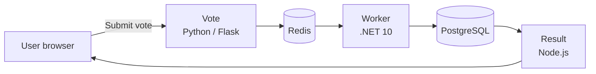
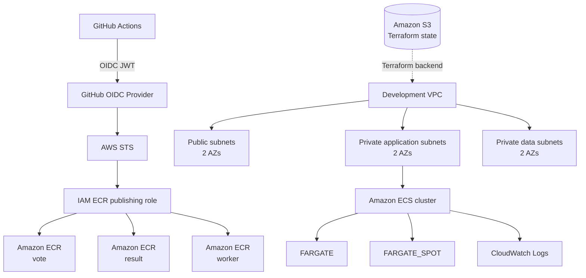

# AWS Voting Platform

A cloud engineering and DevOps portfolio project based on Docker's Example Voting App.

The project demonstrates how a distributed application can be prepared, tested, containerized and incrementally deployed to AWS using Docker, Terraform, GitHub Actions, OpenID Connect, Amazon ECR, Amazon ECS, AWS Fargate, CloudWatch and least-privilege IAM.

Repository: [kxmyk/aws-voting-platform](https://github.com/kxmyk/aws-voting-platform)

## Project status

| Area | Status |
| --- | --- |
| Local Docker Compose baseline | Complete |
| Cloud-ready application changes | Complete |
| Terraform bootstrap and remote state | Complete |
| Multi-AZ VPC and security groups | Complete |
| Amazon ECR repositories | Complete |
| GitHub Actions OIDC federation | Complete |
| Automated image publishing to ECR | Complete |
| ECS cluster foundation | Complete |
| RDS PostgreSQL and ElastiCache Redis | Planned |
| ECS task definitions and services | Planned |
| Application Load Balancer | Planned |
| Automated ECS deployment | Planned |
| Full observability and reliability testing | Planned |

Development infrastructure is intentionally created for testing and destroyed after work sessions. Persistent shared resources, such as the Terraform state bucket, ECR repositories and GitHub OIDC integration, are managed in separate Terraform states.

## Project goals

The project focuses on practical Cloud and DevOps engineering skills:

- operating a multi-service container application;
- preparing applications for managed cloud environments;
- designing AWS networking and security boundaries;
- managing infrastructure with reusable Terraform modules;
- separating persistent shared infrastructure from temporary environments;
- authenticating CI/CD through temporary OIDC credentials;
- applying least-privilege IAM;
- publishing immutable and traceable container images;
- building an Amazon ECS and AWS Fargate architecture;
- controlling AWS costs during development;
- documenting architecture and operations.

Kubernetes is intentionally not required. The target runtime is Amazon ECS with AWS Fargate.

## Application overview

The application allows users to vote between two options and view the results in real time.

| Component | Technology | Responsibility |
| --- | --- | --- |
| `vote` | Python / Flask | Receives votes and places them in Redis |
| `redis` | Redis | Temporarily queues submitted votes |
| `worker` | .NET 10 | Consumes votes and stores them in PostgreSQL |
| `db` | PostgreSQL | Stores voting data |
| `result` | Node.js | Reads and displays results in real time |


```mermaid
flowchart LR
    User[User browser]
    Vote[Vote<br/>Python / Flask]
    Redis[(Redis)]
    Worker[Worker<br/>.NET 10]
    Database[(PostgreSQL)]
    Result[Result<br/>Node.js]

    User -->|Submit vote| Vote
    Vote --> Redis
    Redis --> Worker
    Worker --> Database
    Database --> Result
    Result --> User
```

The core data flow is:

```text
vote → Redis → worker → PostgreSQL → result
```

## Local development

### Requirements

- Docker Engine
- Docker Compose v2
- Git

```bash
docker version
docker compose version
git version
```

### Configuration

```bash
cp .env.example .env
```

Set a local PostgreSQL password:

```dotenv
DB_PASSWORD=replace-with-a-local-development-password
```

Do not commit `.env`.

### Start the stack

```bash
docker compose config
docker compose build
docker compose up --detach --wait
```

| Application | URL |
| --- | --- |
| Vote | http://localhost:8080 |
| Results | http://localhost:8081 |

Useful commands:

```bash
docker compose ps
docker compose logs --follow
docker compose down
docker compose down --volumes
```

Removing volumes deletes local PostgreSQL and Redis data.

## Health and readiness

### Vote

```text
GET http://localhost:8080/health
GET http://localhost:8080/ready
```

Readiness verifies connectivity to Redis.

### Result

```text
GET http://localhost:8081/health
GET http://localhost:8081/ready
```

Readiness verifies connectivity to PostgreSQL.

### Worker

The worker periodically updates a heartbeat file. Its container health check verifies that the heartbeat timestamp is recent.

The application services also:

- log to standard output and standard error;
- handle termination signals;
- run as non-root users;
- use pinned base-image versions;
- read service configuration from environment variables.

## Automated testing

Run the complete Compose integration test:

```bash
./scripts/compose-integration-test.sh
```

The test validates configuration, builds the images, starts the stack, waits for health checks, submits a vote, verifies persistence in PostgreSQL, checks the worker heartbeat and removes test resources.

The same integration flow runs in GitHub Actions.

## Current AWS architecture

The project uses three Terraform roots:

```text
infra/bootstrap
    └── persistent S3 backend bucket

infra/shared
    ├── persistent ECR repositories
    ├── GitHub OIDC provider
    └── GitHub Actions ECR publishing role

infra/environments/dev
    ├── temporary VPC and subnets
    ├── routing and NAT configuration
    ├── security groups
    ├── ECS cluster
    ├── Fargate capacity providers
    ├── CloudWatch log groups
    └── ECS IAM roles
```


```mermaid
flowchart TB
    GitHub[GitHub Actions]
    OIDC[GitHub OIDC Provider]
    STS[AWS STS]
    PublishRole[IAM ECR publishing role]

    ECRVote[Amazon ECR<br/>vote]
    ECRResult[Amazon ECR<br/>result]
    ECRWorker[Amazon ECR<br/>worker]

    State[(Amazon S3<br/>Terraform state)]

    VPC[Development VPC]
    Public[Public subnets<br/>2 AZs]
    App[Private application subnets<br/>2 AZs]
    Data[Private data subnets<br/>2 AZs]

    ECS[Amazon ECS cluster]
    Fargate[FARGATE]
    Spot[FARGATE_SPOT]
    Logs[CloudWatch Logs]

    GitHub -->|OIDC JWT| OIDC
    OIDC --> STS
    STS --> PublishRole
    PublishRole --> ECRVote
    PublishRole --> ECRResult
    PublishRole --> ECRWorker

    State -. Terraform backend .-> VPC
    VPC --> Public
    VPC --> App
    VPC --> Data
    App --> ECS
    ECS --> Fargate
    ECS --> Spot
    ECS --> Logs
```

This diagram represents the implemented foundation. ECS task definitions, ECS services, the Application Load Balancer, RDS and ElastiCache are the next layers.

## Terraform structure

```text
infra/
├── bootstrap/
├── shared/
├── environments/
│   └── dev/
└── modules/
    ├── ecr/
    ├── ecs/
    ├── network/
    └── security/
```

### Bootstrap

`infra/bootstrap` creates the persistent S3 bucket used for Terraform state.

It includes:

- versioning;
- server-side encryption;
- S3 Block Public Access;
- bucket-owner-enforced object ownership;
- a policy denying insecure transport;
- protection against accidental destruction;
- common tags.

### Shared infrastructure

`infra/shared` manages persistent resources:

- ECR repositories for `vote`, `result` and `worker`;
- immutable image tags;
- scan-on-push;
- encryption;
- lifecycle policies;
- GitHub OIDC provider;
- least-privilege IAM role for image publishing.

State key:

```text
shared/terraform.tfstate
```

### Development environment

`infra/environments/dev` manages temporary resources:

- VPC;
- public subnets;
- private application subnets;
- private data subnets;
- Internet Gateway;
- route tables;
- configurable NAT Gateway mode;
- least-privilege security groups;
- ECS cluster;
- Fargate and Fargate Spot capacity providers;
- CloudWatch log groups;
- ECS Task Execution Role;
- separate Task Roles for application services.

State key:

```text
environments/dev/terraform.tfstate
```

## Networking

```text
VPC: 10.20.0.0/16

Public:
- 10.20.0.0/24
- 10.20.1.0/24

Private application:
- 10.20.10.0/24
- 10.20.11.0/24

Private data:
- 10.20.20.0/24
- 10.20.21.0/24
```

The network spans two Availability Zones.

Supported NAT modes:

```text
none
single
per_az
```

Security-group paths:

```text
Internet → ALB:80/443
ALB → Vote:80
ALB → Result:80
Vote → Redis:6379
Worker → Redis:6379
Worker → PostgreSQL:5432
Result → PostgreSQL:5432
```

Redis and PostgreSQL do not accept public traffic.

## Amazon ECR

Private repositories:

```text
aws-voting-platform/vote
aws-voting-platform/result
aws-voting-platform/worker
```

Each repository uses:

- immutable tags;
- scan-on-push;
- AES-256 encryption;
- cleanup of untagged images;
- a maximum retained image count.

Images are tagged with the source commit:

```text
sha-<first-12-characters-of-git-sha>
```

## GitHub Actions and AWS OIDC

GitHub Actions publishes images without long-lived AWS access keys.

```text
GitHub Actions
    ↓ requests OIDC JWT
GitHub OIDC provider
    ↓
AWS STS AssumeRoleWithWebIdentity
    ↓ temporary credentials
least-privilege IAM role
    ↓
Amazon ECR
```

The trust policy validates:

- GitHub as the issuer;
- `sts.amazonaws.com` as the audience;
- immutable owner and repository IDs;
- the exact repository;
- the `main` branch.

The role can publish only to the project's three ECR repositories.

The image workflow:

- runs for relevant changes on `main`;
- supports manual execution;
- uses a matrix for `vote`, `result` and `worker`;
- gets temporary credentials through OIDC;
- logs Docker into ECR;
- creates commit-SHA tags;
- checks whether an immutable tag exists;
- builds missing images with Buildx;
- uses GitHub Actions cache;
- pushes and verifies images;
- writes image URIs and digests to the run summary.

## Amazon ECS foundation

The current ECS layer creates:

- a development ECS cluster;
- `FARGATE`;
- `FARGATE_SPOT`;
- a default strategy using regular Fargate;
- one CloudWatch Log Group per application service;
- seven-day log retention;
- a least-privilege Task Execution Role;
- separate Task Roles for `vote`, `result` and `worker`.

The Execution Role allows ECS/Fargate to:

- obtain an ECR authorization token;
- pull image manifests and layers;
- create CloudWatch log streams;
- send container log events.

Application Task Roles currently have no AWS API permissions because the services do not call AWS APIs directly.

## Project structure

```text
.
├── .github/
│   └── workflows/
├── infra/
│   ├── bootstrap/
│   ├── shared/
│   ├── environments/
│   │   └── dev/
│   └── modules/
├── result/
├── scripts/
├── vote/
├── worker/
├── docker-compose.yml
├── docker-compose.images.yml
├── .env.example
├── LICENSE
└── README.md
```

## Deployment lifecycle

Persistent resources:

```text
Terraform state bucket
ECR repositories
GitHub OIDC provider
GitHub Actions IAM role
```

Temporary development resources:

```text
VPC
subnets
NAT Gateway
route tables
security groups
ECS cluster
CloudWatch log groups
ECS development roles
```

Typical workflow:

```bash
terraform -chdir=infra/environments/dev plan -out=tfplan
terraform -chdir=infra/environments/dev apply tfplan

# run tests

terraform -chdir=infra/environments/dev plan -destroy -out=tfplan-destroy
terraform -chdir=infra/environments/dev apply tfplan-destroy
```

Always review saved plans before applying them.

## Security principles

- no AWS access keys in the repository;
- CI/CD authentication through OIDC;
- no hardcoded database passwords;
- no committed `.env`;
- no public access to Terraform state;
- private application and data subnets;
- no public Redis or PostgreSQL;
- least-privilege IAM;
- separate application Task Roles;
- immutable image tags;
- encrypted state and ECR repositories;
- explicit log retention;
- infrastructure managed through Terraform.

## Cost management

- development infrastructure is destroyed after work sessions;
- NAT Gateway deployment is configurable;
- Container Insights remains disabled until needed;
- CloudWatch Logs use short retention in `dev`;
- ECR lifecycle policies remove old images;
- Fargate tasks are not left running;
- Fargate Spot is available for interruption-tolerant workloads.

## Completed milestones

- local Docker Compose baseline;
- cloud-ready application configuration;
- service health and readiness checks;
- graceful shutdown and non-root containers;
- automated application and integration tests;
- secure Terraform remote state;
- reusable Terraform modules;
- Multi-AZ VPC and least-privilege security groups;
- ECR repositories and lifecycle management;
- GitHub Actions OIDC federation;
- automated matrix builds and ECR publication;
- ECS cluster foundation;
- Fargate and Fargate Spot;
- CloudWatch log groups;
- ECS execution and application roles;
- real AWS apply, verification and teardown testing.

## Next milestones

1. Deploy Amazon RDS PostgreSQL.
2. Deploy Amazon ElastiCache Redis.
3. Store credentials in AWS Secrets Manager.
4. Create ECS task definitions.
5. Run one-off Fargate tasks.
6. Add an Application Load Balancer.
7. Create ECS services.
8. Extend GitHub Actions with ECS deployment.
9. Add alarms, dashboards and rollback tests.
10. Complete runbooks and portfolio documentation.

## Known limitations

- Redis lists provide a simplified queue;
- messages can be lost between Redis removal and a failed database write;
- there is no dead-letter queue;
- there is no full acknowledgement mechanism;
- browser identifiers are not secure user identities;
- there is no user authentication;
- ECS services and managed data services are not deployed yet;
- the development environment prioritizes learning and cost control over production availability.

## Original project

This repository is based on Docker's Example Voting App:

[github.com/dockersamples/example-voting-app](https://github.com/dockersamples/example-voting-app)

The original workload has been extended with cloud-ready configuration, health checks, automated integration testing, Terraform infrastructure, AWS networking, ECR, OIDC-based CI/CD, ECS foundations, security controls and operational documentation.

## License

The original project license has been preserved.

See [LICENSE](LICENSE) for details.